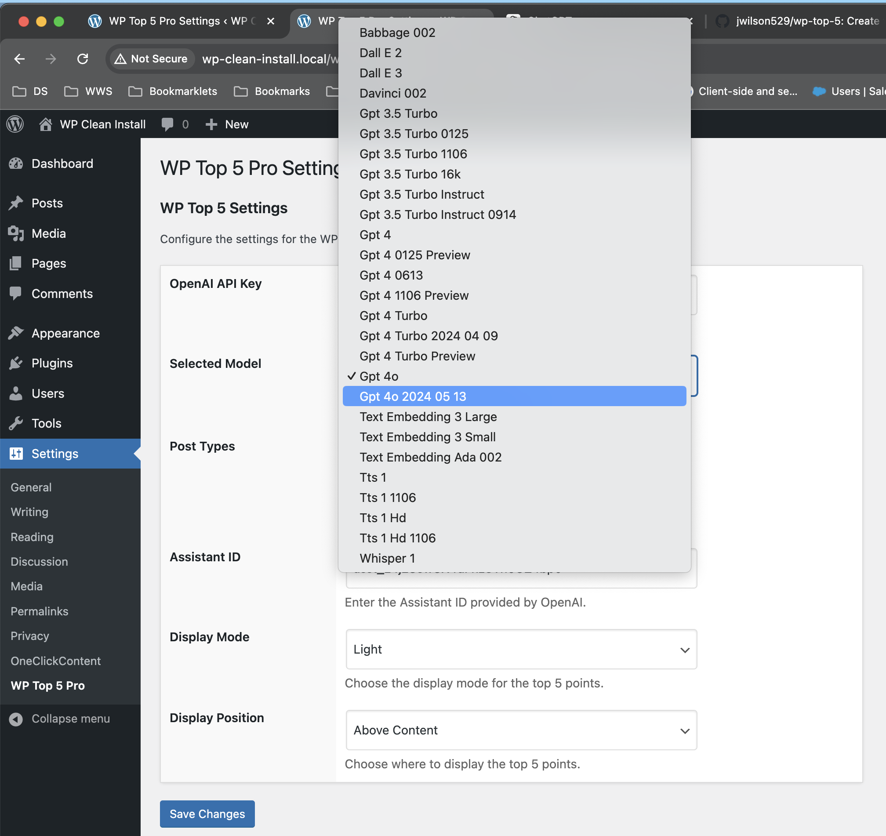
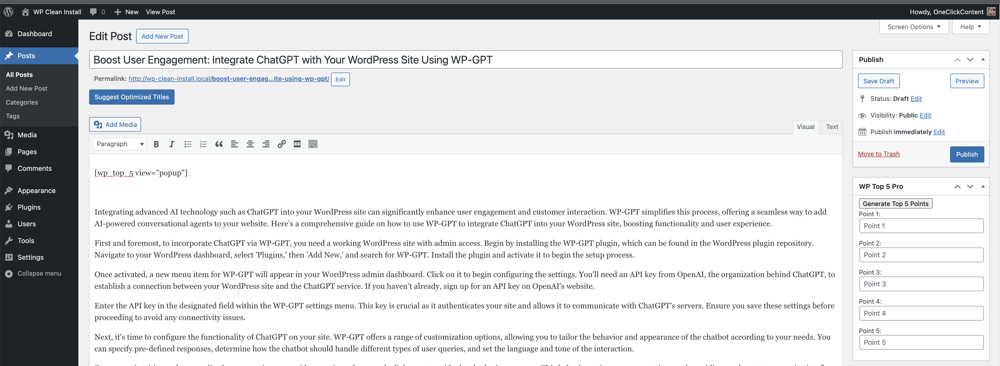
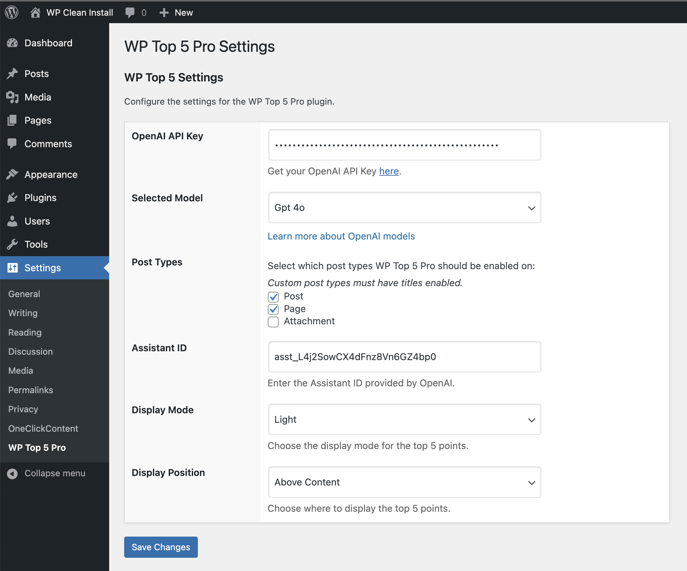

# SummarAIze - Generate Key Takeaways with AI

## Description

SummarAIze is a WordPress plugin that allows you to automatically generate and display the top 5 key points of your posts. Enhance your content by providing readers with quick takeaways, making your articles more engaging and accessible.

## Features

- Automatically generate top 5 key points from post content.
- Display key points in various styles and positions.
- Customizable through settings for display mode and position.
- User-friendly interface for managing key points.

## Installation

1. Upload the plugin files to the `/wp-content/plugins/summaraize` directory, or install the plugin through the WordPress plugins screen directly.
2. Activate the plugin through the 'Plugins' screen in WordPress.
3. Use the Settings->SummarAIze screen to configure the plugin.
4. Use your own Open AI API key.
5. Use the default Assistant ID or configure your own.

## Important Note

The Assistant ID configures the behavior and responses of the SummarAIze assistant. Users must use their own OpenAI API key for authentication and billing.

## Frequently Asked Questions

### How does the plugin generate key points?

The plugin uses advanced AI algorithms to analyze your post content and extract the top 5 key points.

### Can I customize the display of the key points?

Yes, you can customize the display mode and position through the plugin settings.

## Screenshots

1. 
   *Configure whether the key points appear above or below the content.*

2. 
   *Display key points in dark mode for a better visual experience.*

3. 
   *Choose the AI model to use for generating key points.*

4. 
   *Use shortcode to override default key points display settings.*

5. 
   *Interface for generating and editing key points in the Classic Editor.*

6. 
   *Display key points in a popup view.*

7. 
   *The settings page for configuring display options.*

## Changelog

### 1.0.0
* Initial release

## Upgrade Notice

### 1.0.0
* Initial release

## License

This plugin is licensed under the GPLv2 or later.
