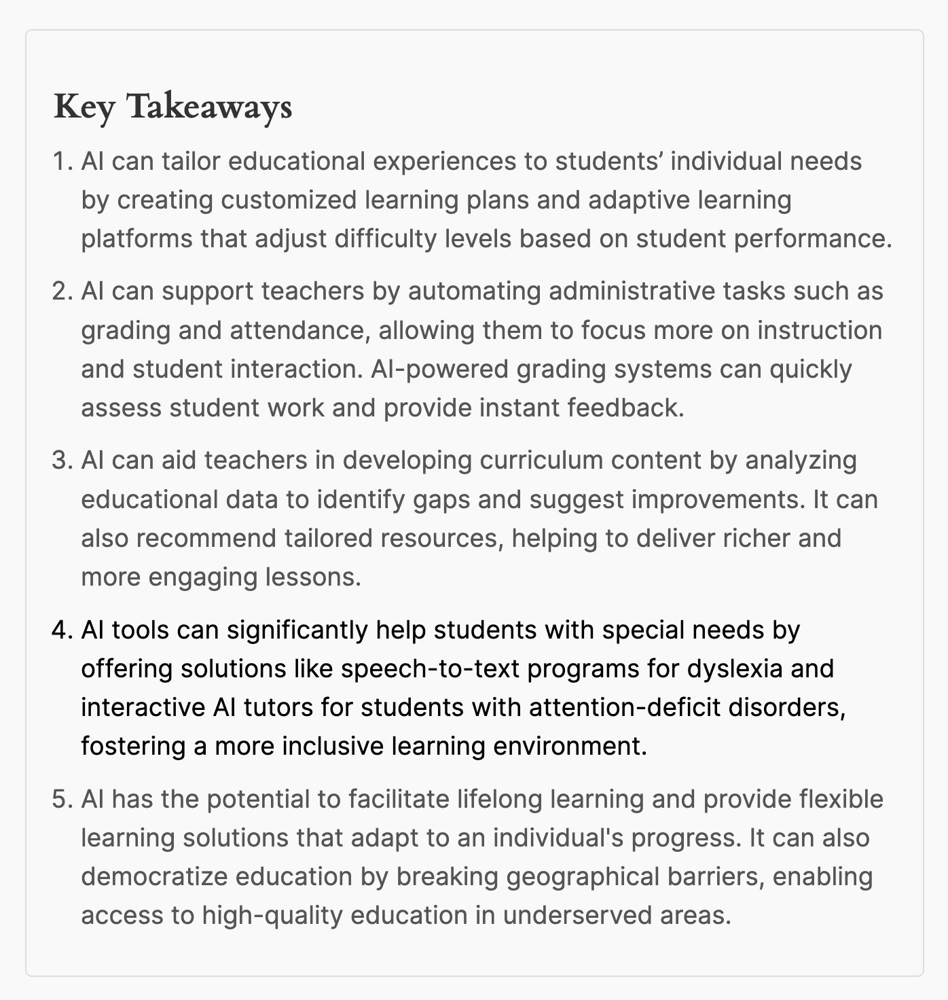
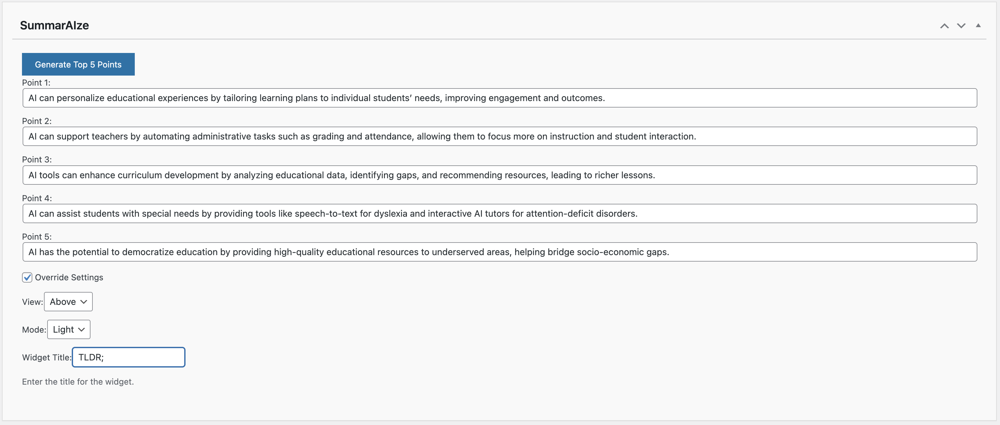

# SummarAIze - Generate Key Takeaways with AI

## Description

**SummarAIze** is a powerful WordPress plugin designed to automatically generate and display the top 5 key points from your posts. With AI-driven content summarization, this plugin enhances your articles by providing readers with quick and engaging takeaways, making your content more accessible and easier to digest.

Whether you're a blogger looking to highlight essential points or a marketer wanting to ensure your audience gets the most out of your content, SummarAIze helps improve user engagement and retention by providing concise, easily digestible summaries.

### Important Information

SummarAIze relies on the OpenAI API to generate key takeaways. This means that data from your site will be sent to OpenAI's servers for processing, and results will be returned to your site. By using this plugin, you agree to OpenAI's [Terms of Use](https://openai.com/terms) and [Privacy Policy](https://openai.com/privacy).

## Features

- **AI-Powered Content Summarization**: Automatically generate top 5 key points from post content using AI.
- **Customizable Display Options**: Display key points in various styles and positions to suit your theme.
- **Ordered or Unordered Lists**: Choose between an ordered list (numbered) or an unordered list (bulleted) for displaying key points.
- **User-Friendly Interface**: Easily manage and customize key points for each post or page.
- **Flexible API Integration**: Integrate with your own OpenAI API key, allowing for control over usage and billing.
- **Assistant Configuration**: Use the default Assistant ID or configure your own in the OpenAI Playground.
- **Enhance SEO and Readability**: Improve your content’s SEO by providing search engines with structured summaries, and enhance readability for your audience.

## Shortcode Documentation

The Summaraize shortcode is used to display the top 5 key points for a post. You can customize the display with several attributes, such as the view mode, color, and button style.

### Basic Shortcode Usage:

`[summaraize]`

### Available Attributes:

**id (optional):**  
The post ID for which to display the key points. If not provided, the shortcode will use the current post's ID.
Example: `[summaraize id="123"]`

**view (optional):**  
Defines where the output should be positioned relative to the post content. Possible values are:
– `above`: Places the key points above the content.
– `below`: Places the key points below the content.
– `popup`: Renders a popup button that displays the key points in a modal when clicked.
Default: `above`
Example: `[summaraize view="popup"]`

**mode (optional):**  
Sets the display mode for light or dark theme. Possible values:
– `light`: Light theme.
– `dark`: Dark theme.
Default: `light`
Example: `[summaraize mode="dark"]`

**title (optional):**  
Sets a custom title for the key points widget or popup. If no custom title is provided, the default "Key Takeaways" will be used.
Example: `[summaraize title="Quick Summary"]`

**button_style (optional):**  
Defines the button style when using the popup view. Possible values: `flat`, `rounded`, etc.
Default: `flat`
Example: `[summaraize view="popup" button_style="rounded"]`

**button_color (optional):**  
Sets the background color of the popup button. Use any valid hex color code.
Default: `#0073aa`
Example: `[summaraize view="popup" button_color="#ff0000"]`

**list_type (optional):**  
Specifies how the key points list is displayed. Possible values:
– `ordered`: Displays an ordered list (`<ol>`).
– `unordered`: Displays an unordered list (`<ul>`).
Default: `unordered`
Example: `[summaraize list_type="ordered"]`

### Example Usage:

Basic Usage (displays the key points above the content with default settings): `[summaraize]`

Customizing the Position and Style (displays the key points in a popup with a red button and rounded style): `[summaraize view="popup" button_style="rounded" button_color="#ff0000"]`

Using a Custom Title and Dark Mode: `[summaraize mode="dark" title="Quick Summary"]`

Displaying an Ordered List Below the Content: `[summaraize view="below" list_type="ordered"]`

## Installation

1. Upload the plugin files to the `/wp-content/plugins/summaraize` directory, or install the plugin through the WordPress plugins screen directly.
2. Activate the plugin through the 'Plugins' screen in WordPress.
3. Navigate to Settings->SummarAIze to configure the plugin.
4. Enter your OpenAI API key.
5. Optionally, configure your Assistant ID in the OpenAI Playground.

## Important Note

The Assistant ID configures the behavior and responses of the SummarAIze assistant. Users must use their own OpenAI API key for authentication and billing.

## Frequently Asked Questions

### How does SummarAIze generate key points?

SummarAIze uses advanced AI algorithms to analyze your post content and extract the top 5 key points. This process is managed through the OpenAI API, ensuring high-quality and relevant summaries.

### Can I customize the display of the key points?

Yes! SummarAIze offers several customization options. You can choose to display key points above or below your content, switch between dark and light modes, and even use a popup version with customizable buttons. Additionally, you can override the main settings per post or page by using the provided options.

### What happens if I don’t provide an API key?

The plugin requires an OpenAI API key to function. Without it, the AI-driven features will not be available. Please ensure you have an active OpenAI account and understand the associated costs before using the plugin.

### How secure is the data transmitted to OpenAI?

Data security is a priority. The plugin only transmits the necessary content to OpenAI's servers to generate key points. No other information is shared. Please review OpenAI's [Privacy Policy](https://openai.com/privacy) for more details on how they handle data.

### How can I get support if I run into issues?

If you encounter any issues or have questions about using SummarAIze, you can get support through the [WordPress support forums](https://wordpress.org/support/plugin/summaraize) or by visiting the [official website](https://oneclickcontent.com).

## Screenshots

1. 
   *Configure whether the key points appear above or below the content.*

2. 
   *Display key points in dark mode for a better visual experience.*

3. 
   *Interface for generating and editing key points in the Classic Editor.*

4. 
   *Display key points in a popup view.*

5. 
   *The settings page for configuring display options.*

## Changelog

### 1.1.10
* Added shortcode with attributes so that you could use it anywhere.
* Improved detection of processed shortcodes and generated HTML to prevent duplication.
* Added a more robust detection mechanism for Gutenberg blocks and shortcodes within the content.
* Updated the logic for appending the shortcode automatically only when necessary.

### 1.1.9
* Added advanced settings tab for customizing the Assistant's prompt type, custom instructions, and AI model.
* Implemented model selection dropdown with a default option set to gpt-4o-mini.
* Improved UI with updated CSS for a more polished look.
* Added a warning message in the advanced settings tab to inform users about the need to regenerate the Assistant after changing certain settings.
* Improved AJAX auto-save functionality to handle empty values correctly.

### 1.1.8
* Added option to display key points as ordered or unordered lists.
* Improved handling of floating images with wrapped and cleared output.
* Updated documentation and readme.

### 1.1.4
* Updated readme file to include the details of the 3rd party services being used.

### 1.1.0
* Changed from using a static Assistant to generating the Assistant via the API.

### 1.0.0
* Initial release

## Upgrade Notice

### 1.1.7
* Added ordered/unordered list options for displaying key points. Improved handling of floating images. Ensure you update to benefit from these improvements.

## License

This plugin is licensed under the GPLv2 or later.

## Donate

If you find this plugin useful, please consider [donating](https://oneclickcontent.com/donate/) to support further development.
